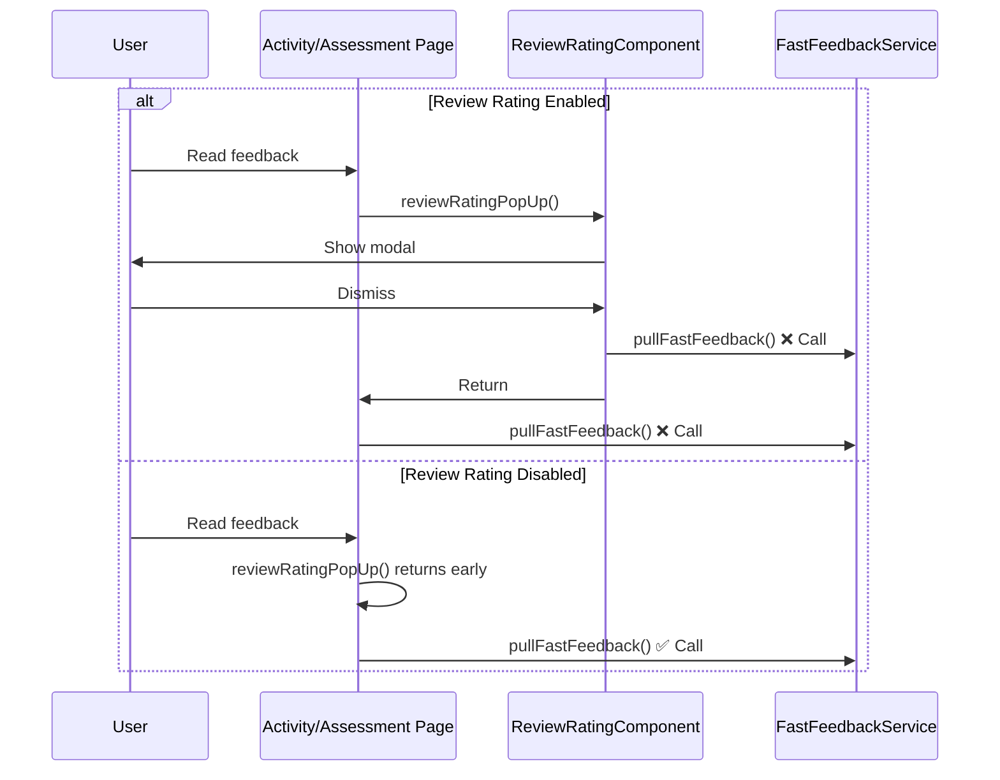
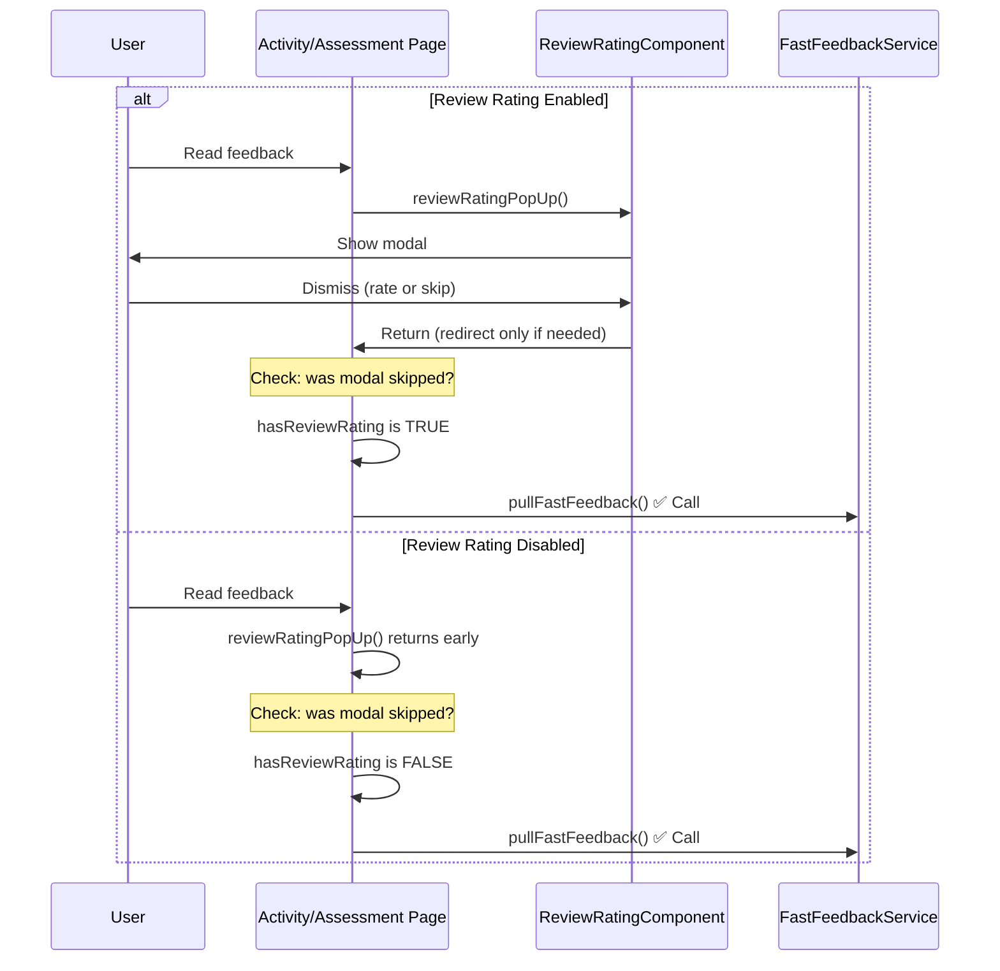

# Review Rating Duplicate API Call Fix

## Issue Summary

When the review rating modal is displayed after feedback reading, the pulse check API (`pullFastFeedback()`) was being called twice:
1. Once by the ReviewRatingComponent when the modal is dismissed
2. Once by the page component (activity-desktop/assessment-mobile) after `reviewRatingPopUp()` returns

This resulted in unnecessary duplicate GraphQL API calls, impacting performance and potentially causing race conditions.

## Root Cause

The original implementation added an explicit `pullFastFeedback()` call in the page components to fix the case where the review rating modal was skipped (when `assessment.hasReviewRating === false`). However, when the modal IS shown, the ReviewRatingComponent's `dismissModal()` method already calls `pullFastFeedback()` through `fastFeedbackOrRedirect()`, resulting in the duplicate call.

## Solution

### Approach

**Conditional pulse check execution**: Only call `pullFastFeedback()` from page components when the review rating modal was actually skipped.

- **When modal is skipped** (user/assessment has review rating disabled): Page component calls `pullFastFeedback()`
- **When modal is shown**: ReviewRatingComponent handles `pullFastFeedback()` on dismiss (no longer - see architectural change below)

### Architectural Change

To follow separation of concerns and match the pattern used in assessment submissions:
- **Removed** pulse check responsibility from ReviewRatingComponent
- **Centralized** pulse check calls in page components (activity-desktop, assessment-mobile)
- ReviewRatingComponent now only handles redirect navigation

## Implementation Flow

### Before Fix

### After Fix

## Files Modified

### Code Changes

1. **projects/v3/src/app/pages/activity-desktop/activity-desktop.page.ts**
   - Added conditional check in `readFeedback()` method
   - Only calls `pullFastFeedback()` when `hasReviewRating === false`

2. **projects/v3/src/app/pages/assessment-mobile/assessment-mobile.page.ts**
   - Applied identical conditional logic in `readFeedback()` method
   - Ensures mobile and desktop behavior is consistent

3. **projects/v3/src/app/components/review-rating/review-rating.component.ts**
   - Refactored `fastFeedbackOrRedirect()` method
   - Removed pulse check call when `!redirect`
   - Now only handles redirect navigation

### Dead Code Removal

4. **projects/v3/src/app/services/notifications.service.ts**
   - Removed unused `trackInfo()` method (lines 1055-1064)
   - Method was superseded by home page's local `onTrackInfo()` implementation

5. **projects/v3/src/app/components/pop-up/pop-up.component.html**
   - Removed unused `pulseCheckStatus` modal case (lines 48-59)
   - Only referenced by deleted `trackInfo()` method

## Testing Approach

### Manual Testing Scenarios

1. **Review rating enabled (user level + assessment level)**
   - Read feedback → Review rating modal shows → Dismiss
   - Verify pulse check modal appears once
   - Check network tab for single `pullFastFeedback` GraphQL call

2. **Review rating disabled (user level)**
   - Read feedback → No review rating modal
   - Verify pulse check modal appears immediately
   - Check network tab for single `pullFastFeedback` GraphQL call

3. **Review rating disabled (assessment level)**
   - Read feedback → No review rating modal
   - Verify pulse check modal appears immediately
   - Check network tab for single `pullFastFeedback` GraphQL call

4. **Review rating with redirect**
   - Complete review rating → Submit with redirect
   - Verify navigation to next task works correctly
   - Verify pulse check appears before redirect

### Test Files to Update

- `projects/v3/src/app/pages/activity-desktop/activity-desktop.page.spec.ts`
- `projects/v3/src/app/pages/assessment-mobile/assessment-mobile.page.spec.ts`
- `projects/v3/src/app/components/review-rating/review-rating.component.spec.ts`
- `projects/v3/src/app/services/notifications.service.spec.ts`

## Performance Impact

**Before**: 2 GraphQL API calls per review rating flow (when modal shown)
**After**: 1 GraphQL API call per review rating flow

**Estimated savings**: 50% reduction in pulse check API calls for review rating flows where modal is displayed

## Edge Cases Handled

1. **User-level review rating disabled**: `storageService.getUser().hasReviewRating === false`
2. **Assessment-level review rating disabled**: `assessmentService.assessment?.hasReviewRating === false`
3. **Redirect scenarios**: Review rating component still handles redirect navigation correctly
4. **No redirect scenarios**: Pulse check now handled by page components

## Related Changes

- Initial implementation: Added `hasReviewRating` parameter to `popUpReviewRating()` method
- Bug fix: Added explicit `pullFastFeedback()` calls when modal skipped
- Optimization: This fix to prevent duplicate calls when modal shown
- Cleanup: Removed unused `trackInfo()` method and `pulseCheckStatus` modal type

## Future Considerations

- Consider returning modal reference from `popUpReviewRating()` if more modal state detection is needed
- Monitor for similar duplicate API call patterns in other modal workflows
- Consider extracting modal lifecycle detection into a reusable pattern/service
